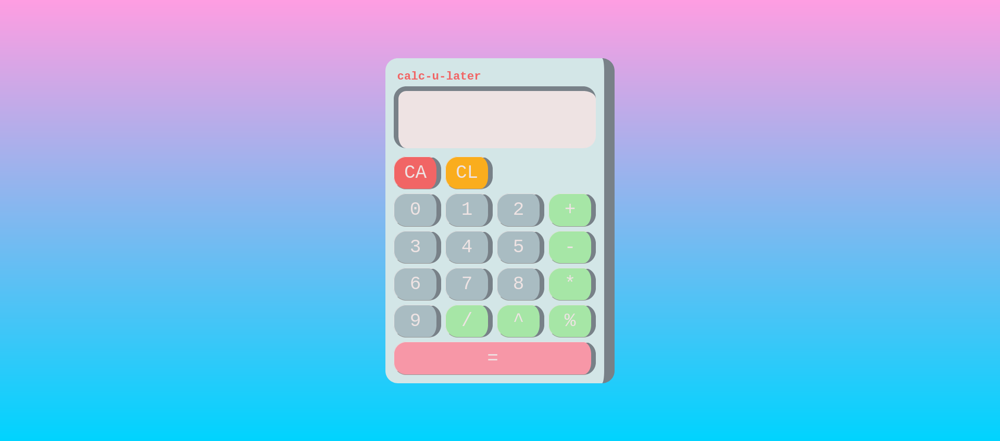

# CALC-U-LATER - a basic javascipt calculator
**Author** David Williams
**Date** January 2022
**Last** Updated January 2022

## About

This project aims to replicate the functions of a basic calculator using a running total method. This version does not use BODMAS. 

## Technologies

**HTML**, **SCSS**, **Javascript**

## Credits / Attributions

**fonts**

- Pixel font from [data font](https://www.dafont.com/pixel-lcd7.font)

## Screenshots

### Desktop

